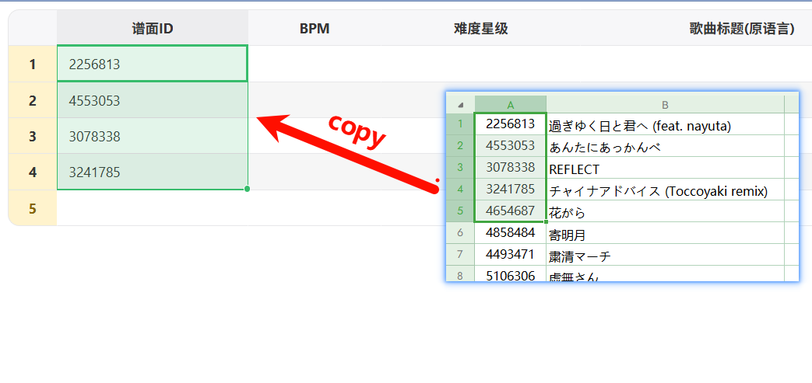
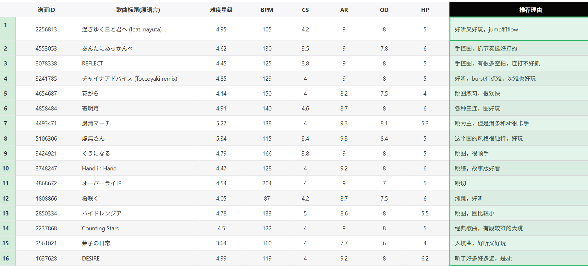
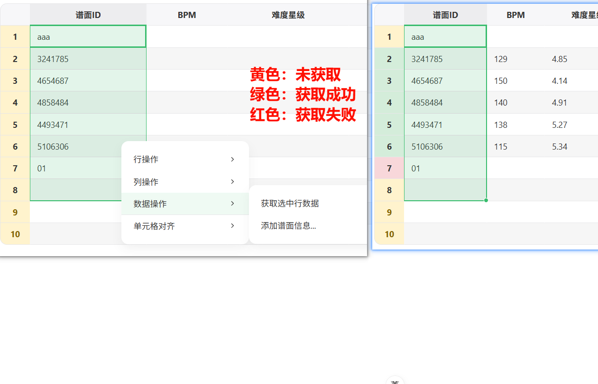
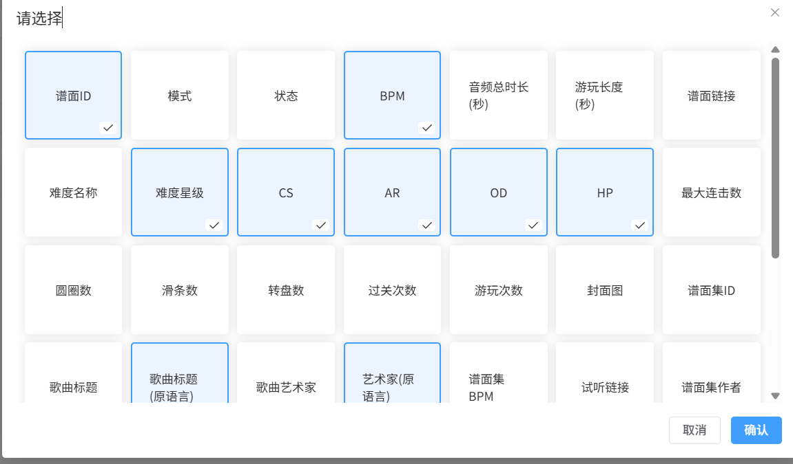

# OsuTool

一个基于Vue 3的osu!谱面信息获取应用
访问网站：https://osutool.xywork.top

## 技术栈

- Vue 3
- Vite
- Vue Router
- JavaScript
- Handsontable (表格组件)

## 功能

- 根据bid批量获取谱面信息
- 使用Handsontable实现表格功能
- 后端采用cloudflare workers实现

## 截图






## 安装指南

1. 克隆仓库

```bash
git clone https://github.com/2710165659/OsuTool.git
```

2. 安装依赖

```bash
npm install
```

3. 运行开发服务器

```bash
npm run dev
```

4. 构建生产版本

```bash
npm run build
```

## 项目结构

```
├── public/            # 静态资源
├── src/
│   ├── assets/        # 图片等资源
│   ├── components/    # Vue组件
│   ├── hook/          # 自定义hooks
│   ├── router/        # 路由配置
│   ├── views/         # 页面视图
│   ├── App.vue        # 根组件
│   └── main.js        # 应用入口
├── .gitignore
├── package.json
├── vite.config.js
└── README.md
```
